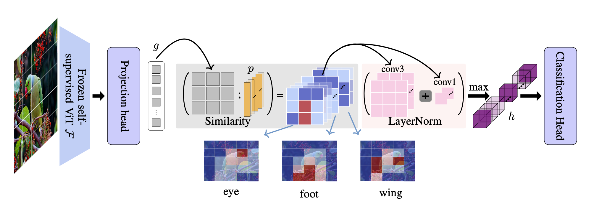
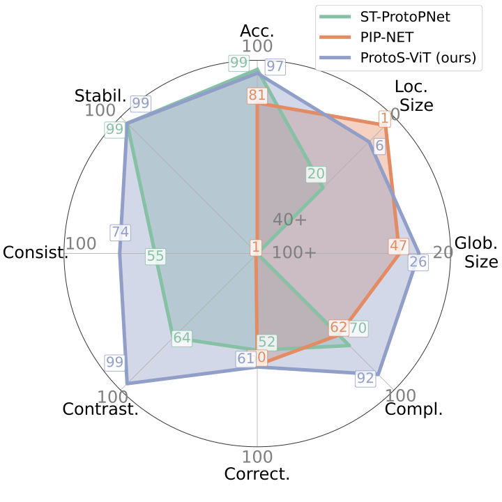

<a href="https://pdm.fming.de"></a>
[](https://pytorch.org/)
[](https://pytorchlightning.ai/)
[](https://hydra.cc/)
# ProtoS-ViT
This is the implementation of ProtoS-Vit along the ressources required to evaluate the model. ProtoS-Vit is a novel architecture to turn any frozen ViT backbone into a prototypical model as shown in the figure below:



The model is evaluated both in terms of classification performance and explanability, outperforming current state-of-the art models across a range of metrics:
<p align="center">

</p>

## Installation
A dockerfile is provided if you want to easily run the project with pdm and the required packages.

## Get Started
If you are running the container, you can start training your model with:
```bash
pdm run train_classification # train a model on the CUB dataset
```
The CUB dataset will be automatically saved in `/data/`.

Configurations are managed with [hydra](https://hydra.cc). Pre-made configurations for a range of experiments can be found in `/config/experiments` but you can also design your own experiment based on these examples. If you want to run your own experiment simply create a new `my_experiment.yaml` file in `/config/experiments` and then run:
```bash
python src/main_train experiment=my_experiment # train a model with your own experiment configuration
```
Configuration files for all experiments presented in the paper can be found under `/config/experiments`.

## Datasets
### General Datasets
The CUB and PETS dataset can be downloaded by setting  `download=True`  in the dataloader argument, i.e hydra config.

***Stanford Cars***

The download URL provided as part of the `StanfordCars` in torchvision is currently broken. The dataset can be downloaded using the following [instructions](https://github.com/pytorch/vision/issues/7545#issuecomment-1631441616).

***Funny Birds***

The Funny birds dataset can be downloaded from the initial repository with the following commands:
```bash
cd /path/to/dataset/
wget download.visinf.tu-darmstadt.de/data/funnybirds/FunnyBirds.zip
unzip FunnyBirds.zip
rm FunnyBirds.zip
```

### Biomedical Datasets
The three biomedical datasets: [ISIC 2019](https://challenge.isic-archive.com/data/#2019), [RSNA](https://www.rsna.org/rsnai/ai-image-challenge/rsna-pneumonia-detection-challenge-2018), [LC25000 (Lungs)](https://arxiv.org/abs/1912.12142v1), use a random split between the training and test set. The split for each dataset is provided in `/data/dataset_name`.

***ISIC 2019***

Classification of skin lesions across nine different diagnostic categories. The dataset can be dowloaded from [here]((https://challenge.isic-archive.com/data/#2019)) and copied into `data/isic_2019`.

***RSNA***

Binary classification of chest x-rays for the presence of pneumonia cases. Data can be downloaded from [Kaggle](https://www.kaggle.com/c/rsna-pneumonia-detection-challenge/data).


***LC25000***

Classification of lung and colon histopathological images. In this work, we focus on the lung dataset which aim to classifiy the images across three different classes. The dataset can be downloaded from [here](https://academictorrents.com/details/7a638ed187a6180fd6e464b3666a6ea0499af4af).

## Explainability evaluation
The quantitative evaluation of the model's explainability relies on the FunnyBirds dataset as well as some of the metrics presented in the [paper](https://openaccess.thecvf.com/content/ICCV2023/papers/Hesse_FunnyBirds_A_Synthetic_Vision_Dataset_for_a_Part-Based_Analysis_of_ICCV_2023_paper.pdf) introducing this dataset by Hesse et al. The metrics presented by Hesse et al. can be computed for a model trained on the FunnyBirds dataset as follows:
```bash
python src/evaluation/main_evaluate_funny_birds  --path_sim=path_sim # with the path to the folder where the trained model is saved.
```
## Acknowledgements

The repository architecture was build on the initial template found [here](https://github.com/ashleve/lightning-hydra-template).
